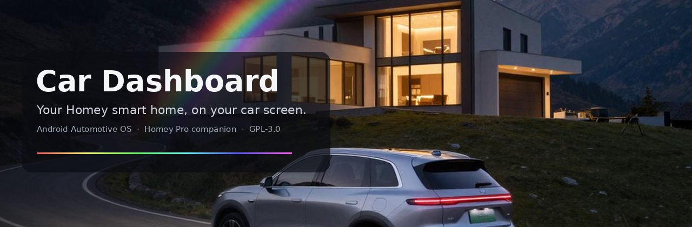
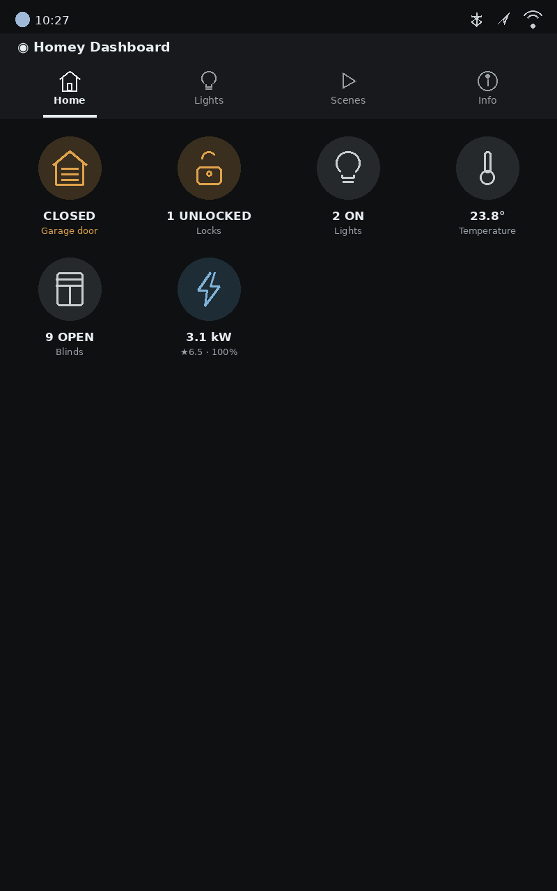
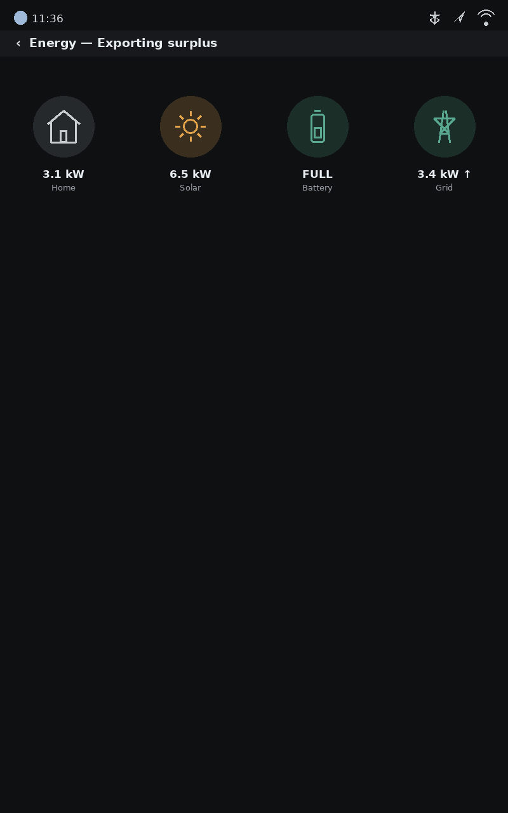
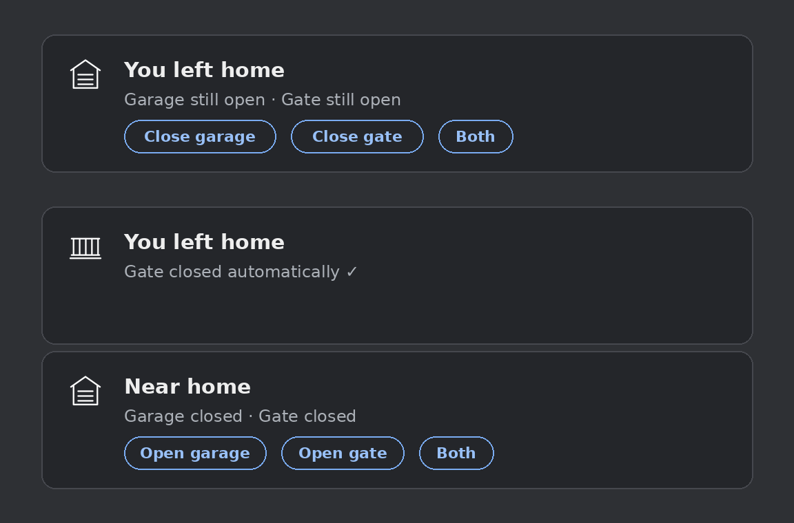

# Car Dashboard — Android Automotive OS app



🇬🇧 English *(the car follows the vehicle's language once string
resources land — see the roadmap)*

Your [Homey](https://homey.app) smart home on the car's own screen — and
the car as a participant in it. A native Android Automotive OS app built
on Google's [Android for Cars App Library](https://developer.android.com/training/cars/apps):
templates only, distraction-optimized, usable while driving. Tested daily
on a Volvo; runs on any car with Google built-in (Volvo, Polestar,
Renault, GM, Honda, Ford lines and others).

**Requires the companion app on your Homey Pro:**
[com.barradas.cardashboard](https://github.com/goncalb/com.barradas.cardashboard),
live on the [Homey App Store](https://homey.app/a/com.barradas.cardashboard).
The car app is on Google Play, currently internal testing — post your
Gmail on the
[community topic](https://community.homey.app/t/app-pro-car-dashboard-for-android-automotive-volvo-polestar-renault/158804)
to be added.

**No account in the vehicle.** Pairing happens once with a short-lived
code from the companion's settings; the car receives a per-car, revocable
token that can only ever see the devices you whitelisted. The car stores
that token and nothing else. No analytics, no third-party SDKs, no
foreground services.

See [CHANGELOG.md](CHANGELOG.md) for the full version history.

## What it does



- **Home grid** — big one-tap tiles: garage door, gates, locks, blinds,
  window sensors, temperature, live energy. State on the badge (green =
  settled, amber = wants attention), your label beneath
- **Lights** by room — whole room or single light; dimmers get a level
  screen with steppers and presets
- **Scenes** — the Flows you picked, as buttons
- **Blinds / Locks / Sensors** — lists with state, level screen for
  blinds (100 / 0 / 75 / 50 / 25, extremes first so both are reachable
  while driving)
- **Energy** — live flows (home, solar, battery, grid, EV charger) and
  Homey Energy's daily totals with self-sufficiency computed



## Geofencing — the car takes part



The car keeps a geofence around your home (coordinates come from the
Homey's own location). Everything below runs **headless** — the app does
not need to be open — and survives reboots and Play Store updates.

| Crossing | What happens |
|---|---|
| Departure, a garage or gate still open | One notification, "You left home", a button per pending action (*Close garage*, *Close gate*) plus **Both/All** when there are several; anything already closed is mentioned, not buttoned |
| Departure, tile set to *Close automatically* | The barrier closes itself and the same notification carries the receipt ("Garage closed automatically ✓") |
| Arrival, barriers closed | "Near home" with *Open* buttons — opening is never automatic |
| 20 minutes unactioned | Buttons expire (the notification times out) |

Which tiles take part, and whether departure notifies or acts, is a
per-tile choice in the companion's settings.

## While driving

The car host limits what an app may show while moving (on Volvo,
roughly the first six rows of a list). Every list therefore opens with a
permanent summary row — "12 lights · 3 on" when parked — that reads
"Full list when parked" while the cut is active. Nothing reshapes while
driving: changing a list's structure counts as a *task step* and five
of them pause the whole app, a lesson learned on the road. Pushed
screens open in the host's loading state so they fill in while moving.

## Security model

| | |
|---|---|
| Pairing | Homey ID + one-time code from the companion (5-minute TTL, single use, lockout after repeated failures) |
| Token | Per car, revocable from Homey, scoped to the whitelist |
| Transport | HTTPS to Athom's cloud API; cleartext explicitly banned in the network security config |
| Actions | Token in the request **body**, never in URLs |
| Location | Only for the geofence; never sent anywhere; optional — everything else works without it |

## Building from source

Android Studio (Ladybug or newer), JDK 17.

```
git clone https://github.com/goncalb/car-dashboard-aaos
cd car-dashboard-aaos
./gradlew :automotive:assembleDebug        # emulator / dev
./gradlew :automotive:bundleRelease        # Play upload (.aab)
```

Emulator: SDK Manager → Automotive system images (with Play Store), run
the `automotive` configuration. Real cars install only through the Play
Store — retail AAOS vehicles do not sideload — and template apps need
Google's Automotive App Host, which comes with Google built-in.

`minCarApiLevel` is deliberately 1 with a runtime check: declaring a
higher level crashes instantly on older hosts.

## Branding & assets

- Launcher icon: `res/drawable` adaptive icon — full-bleed rainbow arc
  with a house, tuned on the Volvo app grid and dock
- Tile and row icons: a single hand-drawn hairline set (`res/drawable/ic_*.xml`)
- Badge colours: green settled, amber attention, neutral grey (`Badges.kt`)
- Play assets and README images: `docs/`

## Project structure

```text
automotive/src/main/java/com/example/homeycar/
  CarApp.kt               CarAppService, TabTemplate session, all screens
  HomeyClient.kt          /state and /action client, models, blind/lock state rules
  Badges.kt               Badge bitmaps (icon + colour) for grid and rows
  Geofencing.kt           Geofence registration + receiver: notifications, auto-close
  NotifActionReceiver.kt  Headless Close/Open/Both from notification buttons
  BootReceiver.kt         Re-registers the geofence after boot and app update
  FenceWorker.kt          Deferred (re)registration
  Config.kt               Constants
automotive/src/main/res/
  drawable/               22 hairline icons + launcher icon layers
  xml/                    automotive_app_desc, network security config
AndroidManifest.xml       Permissions, CarAppService (IOT), receivers
CHANGELOG.md              Version history
```

## Roadmap

- Theme accent colour for section headers and the tab indicator.
- **Translations** — hard-coded strings move to `res/values/strings.xml`
  with `values-nl/-de/-it/-pt`; the host then follows the vehicle's
  language automatically. In step with the companion's `locales/`.
- A native (non-template) flavour for Android cars without Google
  services (BYD, smart, aftermarket units).
- Configurable arrival/departure actions (run a chosen Flow).

## Related projects

[Android Automotive by Simone Di Maio](https://homey.app/a/com.dimapp.aaos)
([car](https://github.com/s-dimaio/HomeyAutomotive) ·
[Homey](https://github.com/s-dimaio/com.dimapp.aaos)) — the other
Homey ↔ AAOS bridge, with an OAuth relay and generic rendering. Both
GPL-3.0; ideas flow both ways.

## License

[GNU GPL v3.0](LICENSE) — free to use, study, modify and share;
derivatives stay open under the same license.
